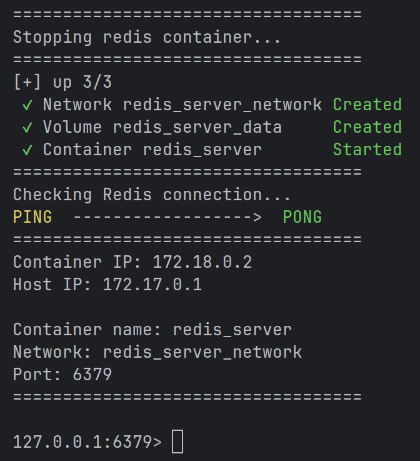
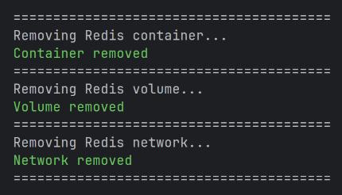

[docker-install]: readme_src/docker-install.md
[redis-host-bind-en]: readme_src/redis-host-bind.en.md
[redis-max-memory-policy-en]: readme_src/redis-max-memory-policy.en.md

# Redis Server

**English** | [Русский](readme_src/README.ru.md)

---

A ready-to-use Redis Docker setup configured via `.env`, with simple scripts for one-command deployment and management.

Requires **[Docker][docker-install]**.

Before starting, make sure that the **external port** is not occupied by other services, and configure the **.env** file.

## Setup and Run

**Copy .env:**
```bash
cp .env.example .env 
```


**Configure the variables in `.env`:**

+ `REDIS_NAME` — name used for the container, volume, and network.
    + Default: `redis_server`
+ `REDIS_PORT` — internal Redis port.
    + Default: `6379`
+ `REDIS_EXTERNAL_PORT` — external port used to connect to Redis.
    + Default: `6379`
+ `REDIS_HOST_BIND_IP` — host IP address used to publish the port. For more information, see **[Network Modes][redis-host-bind-en]**.
    + Default: `127.0.0.1`
+ `REDIS_USERNAME` — username used to connect to Redis.
+ `REDIS_PASSWORD` — password used to connect to Redis.
    + Do not use the `>` character at the beginning of the password.
+ `REDIS_PASSWORD_TYPE` — password type:
    + `>` - plain-text password
    + `#` - password hashed using `SHA-256`
+ `REDIS_MAXMEMORY` - maximum amount of RAM Redis can use.
    + Default: `256mb`
+ `REDIS_MAXMEMORY_POLICY` - **[Redis Max Memory Policy][redis-max-memory-policy-en]**
    + Default: `allkeys-lru`

**`run.sh` behavior variables:**

+ `REDIS_HASH_PASSWORD_VERIFY_PONG` - determines whether to check the Redis connection using `PING` when a hashed password (`#`) is used. If `true`, `run.sh` prompts for the password and verifies it using `PING`. If `false`, the connection check is skipped, and the password will be requested directly when opening the Redis CLI.
    + Default: `true`
+ `REDIS_OPEN_CLI` - if `true`, opens the Redis CLI after Redis has started successfully and the connection has been verified.
    + Default: `true`

**Run the script:**

```bash
sudo ./run.sh
```



If the application runs in Docker, connect its container to the Docker network created by this project and use the Redis container name (`REDIS_NAME`) as the host. If the application runs directly on the host machine, use `REDIS_HOST_BIND_IP` and `REDIS_EXTERNAL_PORT`.

## Remove Redis server

```bash
sudo ./kill.sh
```



## License

This project is licensed under the [MIT License](LICENSE.md).
