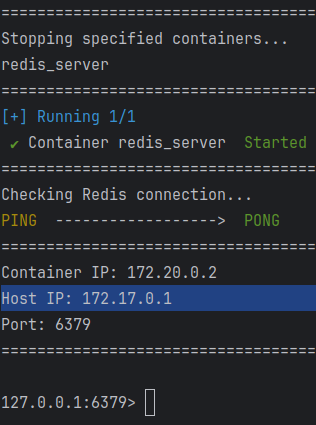

# Redis

Приложение для быстрой развертки Redis-сервера

Используется **Docker**

**Стандартный скрипт установки докера на Debian**
```bash
  sudo apt update
  sudo apt install apt-transport-https ca-certificates curl software-properties-common
  curl -fsSL https://download.docker.com/linux/ubuntu/gpg | sudo gpg --dearmor -o /usr/share/keyrings/docker-archive-keyring.gpg
  echo "deb [arch=$(dpkg --print-architecture) signed-by=/usr/share/keyrings/docker-archive-keyring.gpg] https://download.docker.com/linux/ubuntu $(lsb_release -cs) stable" | sudo tee /etc/apt/sources.list.d/docker.list > /dev/null
  sudo apt update
  sudo apt install docker-ce
  sudo systemctl status docker
```

Перед запуском убедитесь, что **внешний порт** не занят другими сервисами, и настройте файл **.env**

+ **Внутренний порт** используется внутри Docker-контейнера.
+ **Внешний порт** — это порт, который будет использоваться для доступа к Redis снаружи.

## Настройка и запуск

**Скопируйте .env:**
```bash
  cp .env.example .env 
```

**Настройте переменные в .env:**

+ **REDIS_USERNAME** — логин для подключения к Redis.
+ **REDIS_PASSWORD** — пароль для подключения к Redis.
+ **REDIS_EXTERNAL_PORT** — внешний порт для подключения к Redis.
+ **REDIS_PORT** — внутренний порт Redis.

**Запустите скрипт:**

```bash
  sudo ./run.sh
```

Если проекты, которые будут использовать данный Redis-сервер расположены на одной машине, следует использовать **Host IP** для подключения



### Очистить данные Redis-сервера

```bash
  sudo ./clear.sh
```